# Лабораторная №2: генераторы статических сайтов

!!! warning "Черновик"
    Отчёт заполняется по ходу работы. Разделы с пометкой «в работе» ещё не закончены.

## Ссылки

| Что | Адрес |
|---|---|
| Репозиторий GitHub | <https://github.com/imkholodkov/steam-market-analysis> |
| Репозиторий SourceCraft (опубликованный сайт) | <https://sourcecraft.dev/imkholodkov/steam-market-analysis> |
| Сайт на GitHub Pages | <https://imkholodkov.github.io/steam-market-analysis/> |
| Сайт на SourceCraft Sites | <https://imkholodkov.sourcecraft.site/steam-market-analysis/> |

## Ход работы

### Окружение и генератор

- Python 3.12 (`.python-version`), менеджер зависимостей `uv`, версии зафиксированы в `uv.lock`.
- Генератор — MkDocs 1.6.1 с темой Material 9.7.7, группа зависимостей `docs` в `pyproject.toml`.
- Версия MkDocs ограничена `<2`: при сборке Material выводит предупреждение, что в MkDocs 2.0
  перестанут работать плагины и переопределения тем.
- `.gitignore` дополнен каталогом сборки `site/`, кэшем `.cache/` и сгенерированными
  результатами `docs/lab2/p3/generated/`.

### Площадки публикации

GitHub Pages переключён с публикации из ветки на GitHub Actions.

| До | После |
|---|---|
| 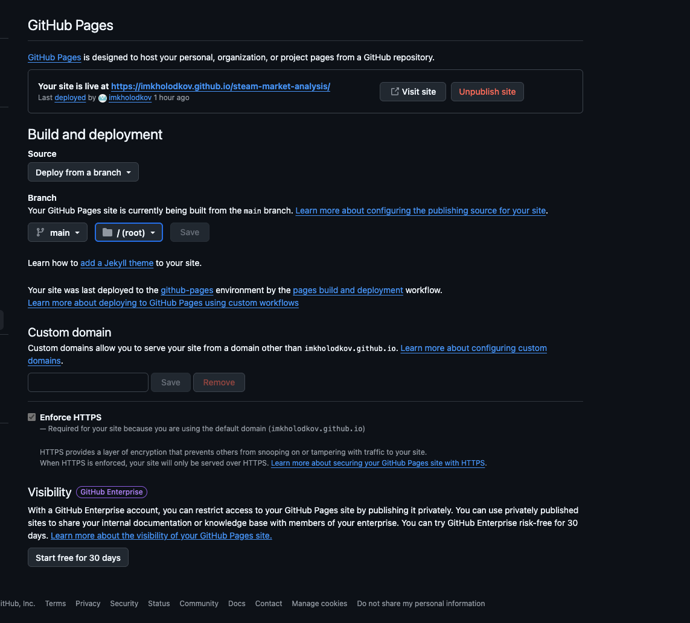 | 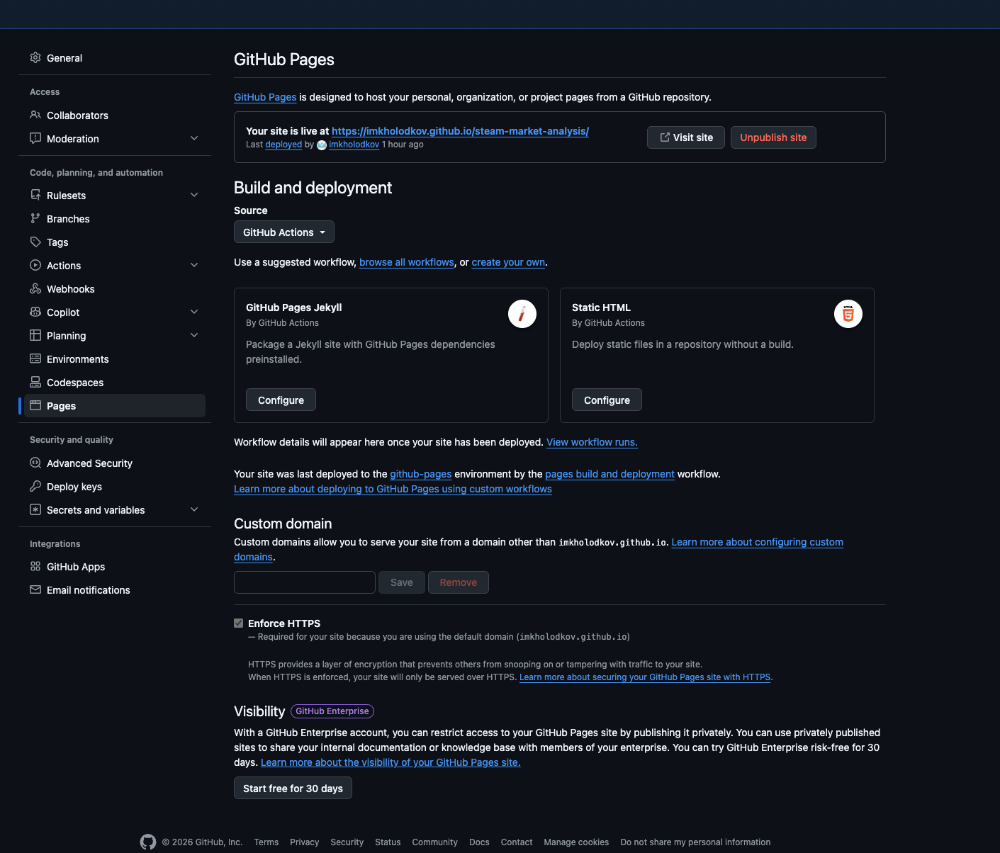 |

Отечественная площадка — SourceCraft Sites: бесплатный хостинг статики из публичного
репозитория публичной организации SourceCraft. Выбран вместо Helios ИТМО.

### Пайплайн

Файл `.github/workflows/deploy.yml` построен на шаблоне GitHub «Static HTML»
(`upload-pages-artifact` + `deploy-pages`), дополненном сборкой MkDocs и второй площадкой.

| Событие | Поведение |
|---|---|
| push в `main` | сборка → деплой на GitHub Pages и SourceCraft → healthcheck |
| push в другую ветку | только сборка в режиме `--strict` |
| pull request | только сборка |
| ручной запуск | как push в текущую ветку |

Успешный запуск на ветке `feat/site-mkdocs`: сборка прошла, деплой пропущен.

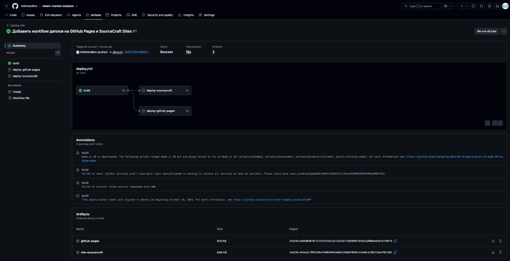

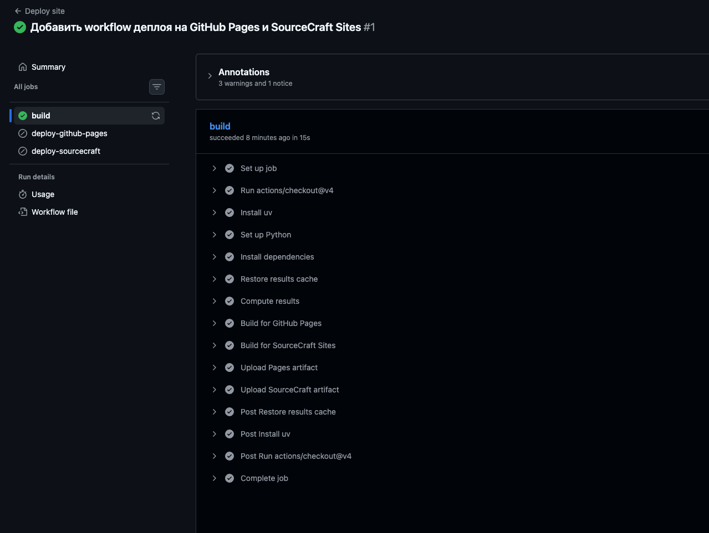

Успешный запуск на `main`: деплой на обе площадки, healthcheck пройден.

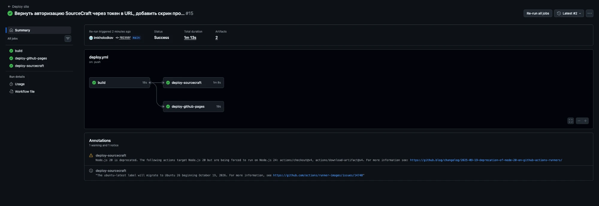

### Проверка развёртывания

**Код ответа и контрольная строка** проверяются шагом `Healthcheck` после каждого деплоя
(`scripts/healthcheck.sh`): страница `lab2/p3/` должна отвечать 200 и содержать заголовок
«Конвейер «данные → результат → сайт»». При несовпадении job падает.

**Поиск.** Встроенный поиск Material с `lang: ru`, проверка в браузере на опубликованном сайте:

| Запрос | Форма слова в тексте | Результат |
|---|---|---|
| `бесплатных` | бесплатных | найдено: 2 |
| `бесплатная` | бесплатных, бесплатный | не найдено |
| `жанр` | жанров | найдено: 2 |
| `жанры` | жанров | не найдено |
| `кэш` | кэш, кэша | найдено: 2 |
| `кэширование` | кэш, кэша | не найдено |
| `отзывов` | отзывов | найдено: 2 |
| `отзывы` | отзывов | не найдено |
| `Steam` | Steam | найдено: 4 |

Поиск находит точную форму слова и слова, которые с запроса начинаются; другие словоформы
не находятся. Добавление `pipeline: [stemmer, stopWordFilter, trimmer]` результат не изменило.
Гипотеза: Material добавляет к запросу `*`, а в lunr термы с `*` не проходят через стеммер,
поэтому русская морфология к запросу не применяется.

**Внешние CDN.** Исходная страница P3 загружала шрифты с Google Fonts и MathJax с jsDelivr.
Недоступность CDN эмулировалась подменой их доменов на несуществующие (`*.invalid`) в копии
собранного сайта. Решение — встроенный плагин Material `privacy`: при сборке он скачивает
внешние ресурсы в `assets/external/` и переписывает ссылки на них.

| Вариант | Внешних запросов | Формулы | Шрифт | Вес страницы P3 | Размер сайта |
|---|---|---|---|---|---|
| CDN | 2 (Google Fonts, jsDelivr) | отображаются | Roboto | 2463 КБ | 4,1 МБ |
| CDN недоступен | 2, оба с ошибкой | **сырой TeX**: `\[ s_i = \frac{p_i}{p_i + n_i} ...` | системный | — | — |
| Плагин `privacy` | 0 | отображаются | Roboto | 2660 КБ | 10,4 МБ |

Вес — сумма несжатых файлов, которые браузер загрузил для страницы. Из 2,4–2,6 МБ около
2 МБ — `tex-svg.js`. С `privacy` страница тяжелее на 197 КБ: 5 файлов шрифтов Roboto
(158 КБ), которые в варианте с CDN браузер не загрузил. Сайт вырос на 6,3 МБ за счёт полной
копии MathJax, загружаемой один раз. Время сборки выросло с 0,17 с до 2,66 с на первой
сборке — плагин скачивает файлы; дальше они берутся из `.cache/plugin/privacy`.
Остаются 2 запроса к `api.github.com` — счётчики звёзд и форков в шапке; без них страница
работает.

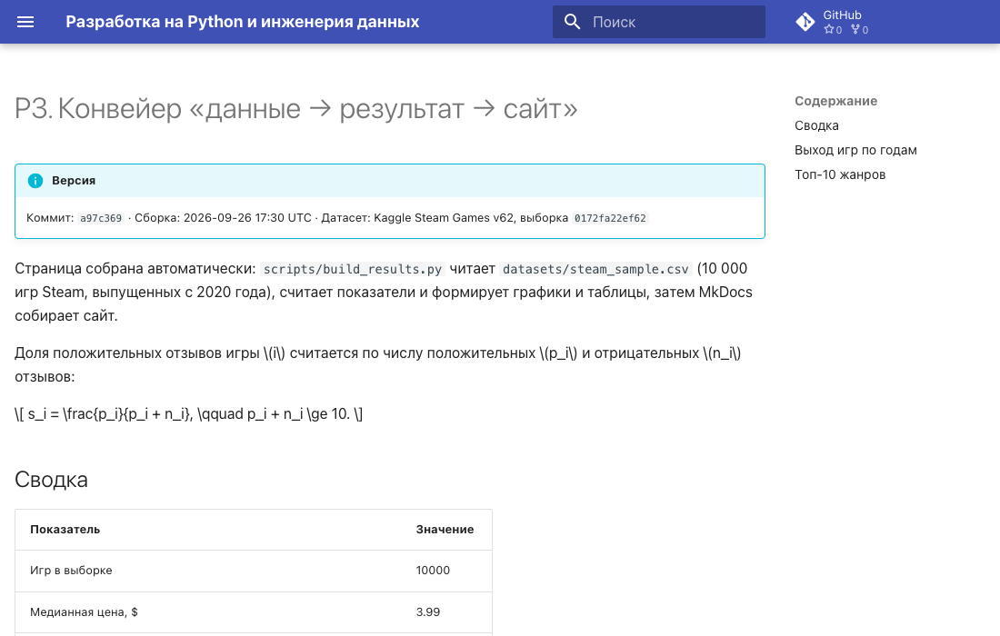

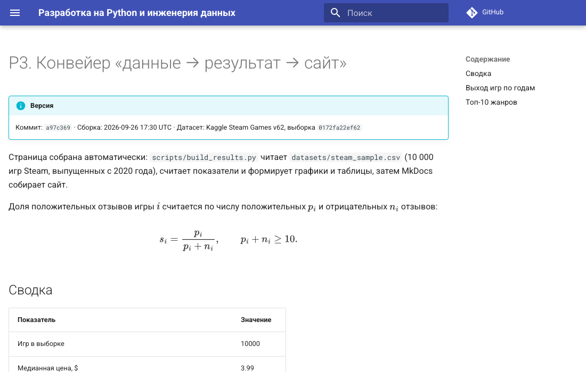

## Исследовательское задание T2

Отчёт — на странице [T2. Конвейер «эксперимент → артефакт → страница»](t2.md).

## Практическое задание P3

Описание конвейера и результаты — на странице [P3. Конвейер данных](p3/index.md).

### Демонстрация: изменение данных → push → обновлённый сайт

Каждое изменение — коммит в `main` с новой выборкой; сайт пересобирается и публикуется без ручных действий.
Время — от `git push` до появления нового хеша выборки на странице (опрос каждые 5 с).

| Шаг | Выборка | Медианная цена | Доля бесплатных | Доля положительных отзывов | Pages, с | SourceCraft, с |
|---|---|---|---|---|---|---|
| исходная: seed 42, все годы | `ea2f02474825` | 4,99 $ | 19,6 % | 81,0 % | — | — |
| seed 43, все годы | `351ef4a31d2a` | 4,99 $ | 19,5 % | 81,6 % | 45 | 46 |
| seed 43, игры с 2020 года | `0172fa22ef62` | 3,99 $ | 22,7 % | 84,7 % | 40 | 40 |

Смена seed даёт небольшое изменение: обе выборки — случайные 10 000 игр из одного датасета,
поэтому меняются метка версии и таблицы, а графики визуально почти те же.
Фильтр по году выхода меняет и графики.

**Исходная выборка (seed 42):**

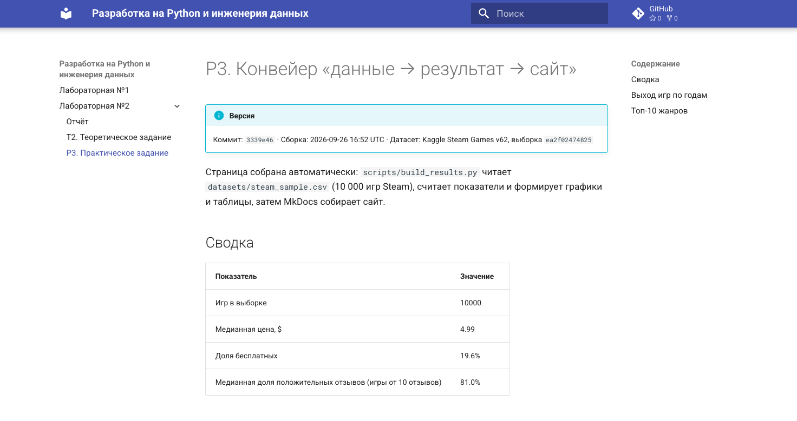

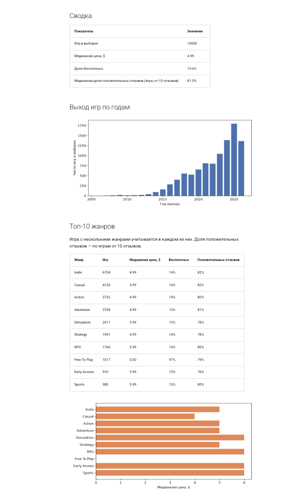

**Seed 43 — небольшое изменение:**

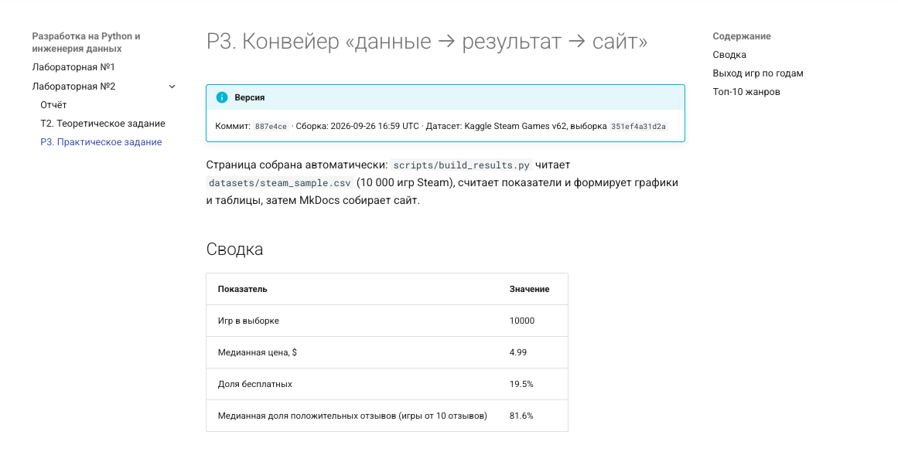

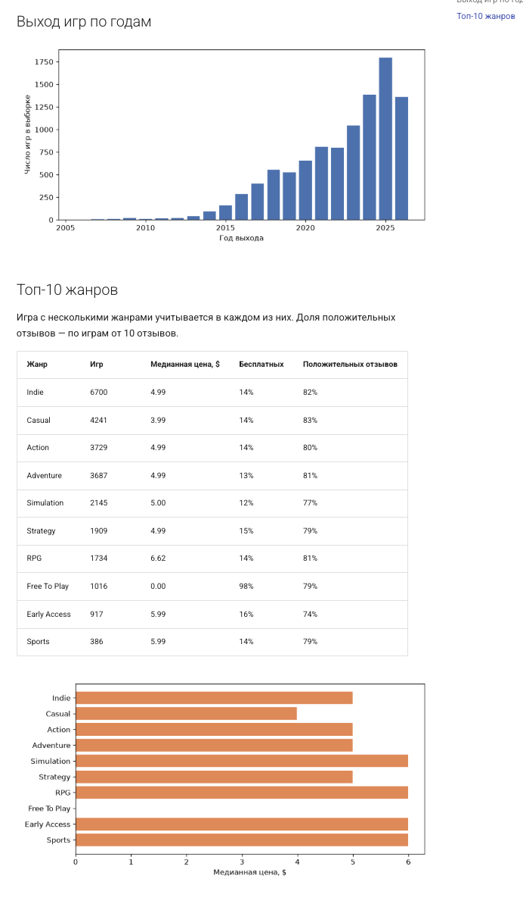

**Игры с 2020 года — заметное изменение:**

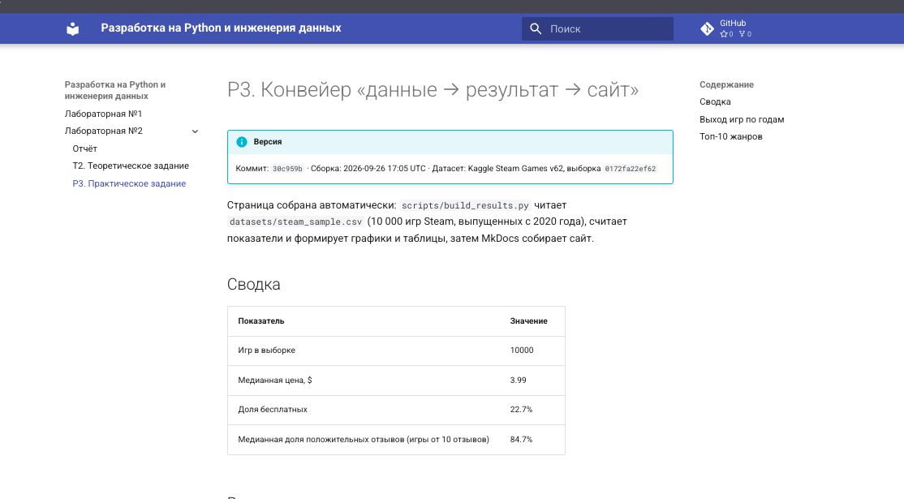

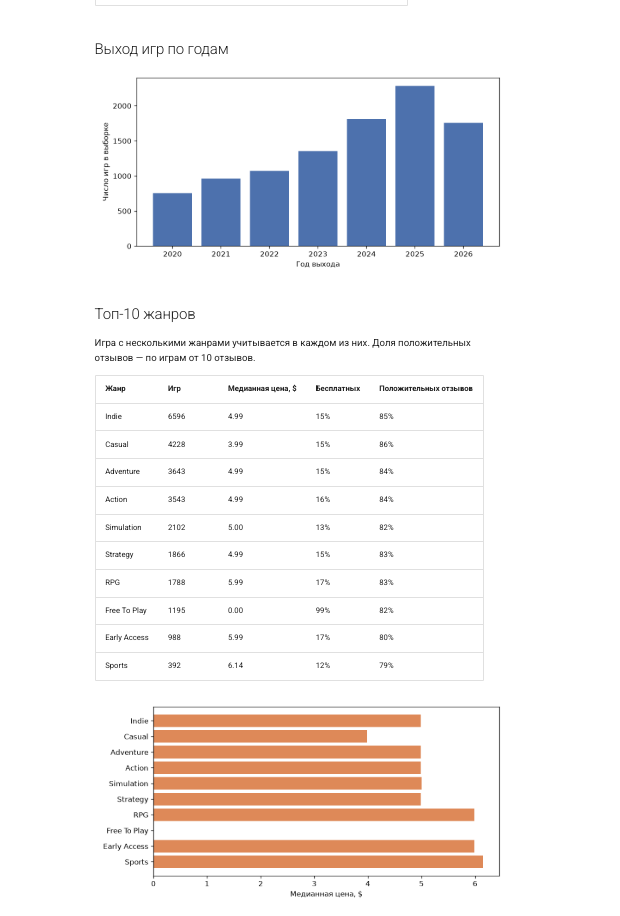

### Замеры

| Прогон | Где | Расчёт | Сборка целиком |
|---|---|---|---|
| без кэша | локально | 0,415 с | 0,77 с |
| с кэшем | локально | 0,001 с | 0,32 с |
| без кэша | GitHub Actions | 2,83 с | job `build` 15 с |
| с кэшем | GitHub Actions | 0,002 с | job `build` 12 с |

## Отладка

| № | Текст ошибки | Гипотеза | Проверка | Решение |
|---|---|---|---|---|
| 1 | `Doc file 'p3/generated/results.md' contains a link 'generated/releases_by_year.png', but the target 'p3/generated/generated/releases_by_year.png' is not found` — `Aborted with 2 warnings in strict mode!` | MkDocs считает вставляемый фрагмент `results.md` отдельной страницей и проверяет ссылки относительно его каталога | в том же логе: `pages exist in the docs directory, but are not included in the "nav": p3/generated/results.md` | `exclude_docs: p3/generated/*.md` в `mkdocs.yml` |
| 2 | pre-commit: `check for added large files...Failed` — `datasets/steam_sample.csv (1270 KB) exceeds 500 KB` | хук `check-added-large-files` с порогом по умолчанию 500 КБ | текст ошибки называет файл и порог | `args: [--maxkb=2048]` для хука |
| 3 | pre-commit `check-yaml`: `could not determine a constructor for the tag '!ENV' in "mkdocs.yml", line 3` | хук разбирает YAML безопасным загрузчиком и не знает тег MkDocs `!ENV` | `mkdocs build` с тем же файлом проходит | `args: [--unsafe]` для `check-yaml` |
| 4 | GitHub Actions, шаг `Install uv`: `Failed to restore: Cache service responded with 400`, `Failed to save: Our services aren't available right now` | сначала — временный сбой сервиса кэша; не подтвердилась: в том же запуске `actions/cache@v4` восстановил кэш результатов. Вторая гипотеза — `astral-sh/setup-uv@v3` обращается к отключённому старому API кэша | поднять `setup-uv` до v10.2.0 и перезапустить | после обновления: `uv cache saved with key: setup-uv-2-...`, ошибок 400 нет |
| 5 | `Unable to resolve action astral-sh/setup-uv@v10, unable to find version v10` | у `setup-uv` нет плавающего мажорного тега `v10`, только точные версии | `gh api repos/astral-sh/setup-uv/releases/latest` → `v10.2.0` | закрепить `astral-sh/setup-uv@v10.2.0` |
| 6 | Ошибки не было, результат неверный: в таблице жанров Indie — 1836 игр из 10 000, у 7467 игр жанр пустой | регулярное выражение ищет только формат `{"description": "Action"}`, а в датасете встречается и второй формат | `genres.isna()` — 0 пустых значений; в случайных строках есть `["Action", "Adventure", "Indie", "RPG"]` | разбор через `json.loads` с поддержкой обоих форматов; Indie — 6704 игры |
| 7 | `deploy-sourcecraft`: `fatal: could not read Username for 'https://git.sourcecraft.dev': No such device or address` | SourceCraft не принимает токен в заголовке `http.extraheader` (или токен недействителен после смены идентификатора организации) | вернуть документированный способ — токен в URL: ошибка сменилась на `fatal: Authentication failed`, значит сервер отверг сам токен, а не способ передачи | перевыпуск токена SourceCraft и обновление секрета, перезапуск упавшего job: `OK: .../p3/ -> 200` |
| 8 | Ошибки нет, результат неверный: после деплоя таблицы и метка версии новые, а график по годам — старый, с 2006 года | браузер взял картинку из своего кэша: имя файла не изменилось | картинка, скачанная с Pages, новая (2020–2026); заголовок ответа `cache-control: max-age=600`; после Cmd+Shift+R график новый | версия в адресе картинок: `releases_by_year.png?v=<ключ кэша>`, при новых данных адрес меняется |
| 9 | С плагином `privacy` формулы рисуются чужим шрифтом, в консоли `404 (File not found)` для `.../mathjax@3/es5/output/chtml/fonts/woff-v2/MathJax_Zero.woff` | CHTML-вывод MathJax подгружает шрифты из своего скрипта во время работы, `privacy` видит только ссылки в HTML и CSS и эти файлы не скачивает | `find site/assets/external -name 'MathJax_Zero*'` — пусто | SVG-вывод `tex-svg.js`: формулы рисуются без веб-шрифтов |
| 10 | `Uncaught TypeError: MathJax.startup.output.clearCache is not a function` в `javascripts/mathjax.js` | фрагмент настройки из документации Material рассчитан на CHTML-вывод, у SVG-вывода этого метода нет | тот же стек после перехода на `tex-svg.js` | `MathJax.startup.output.clearCache?.()` |

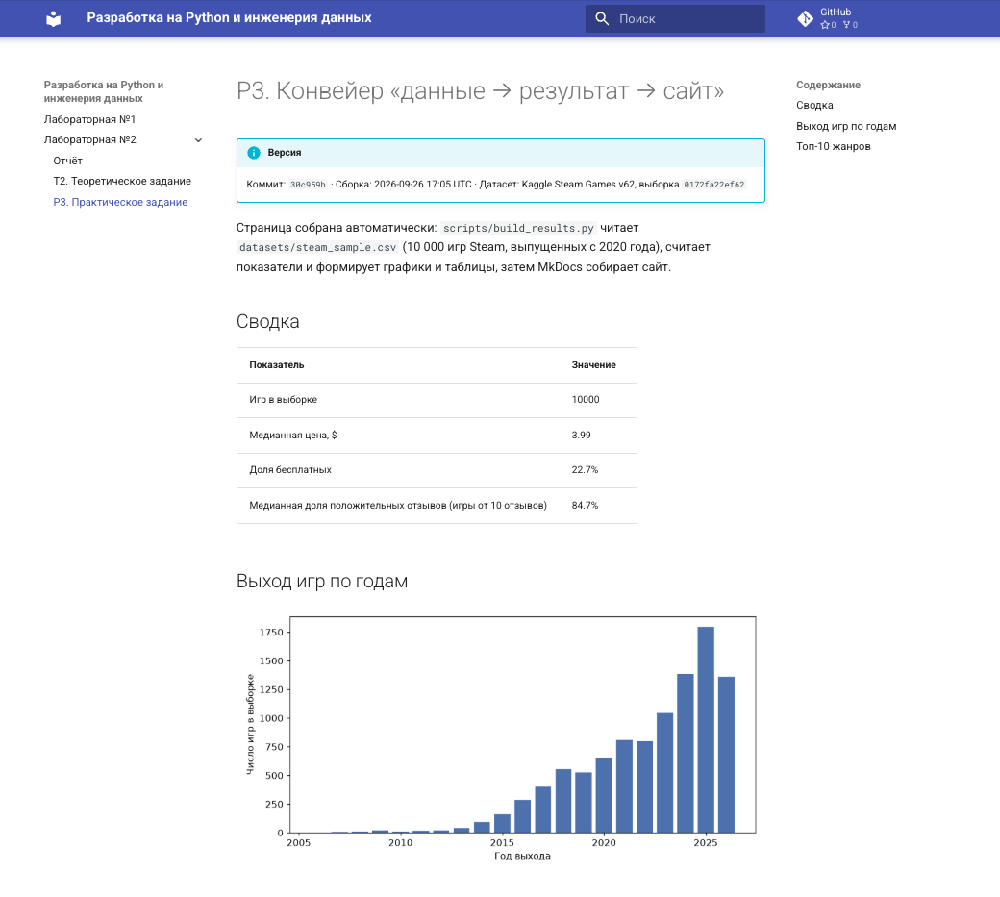

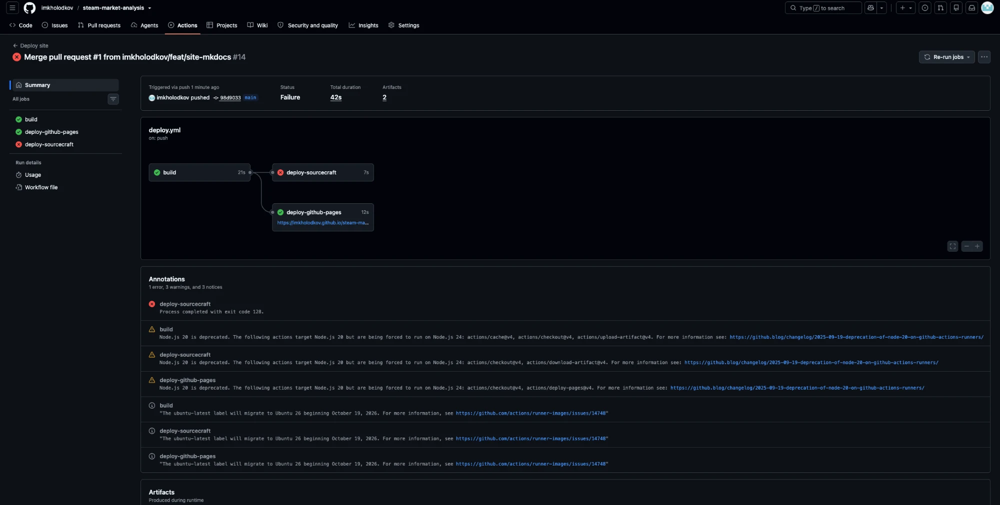

## Вывод

*В работе.*
